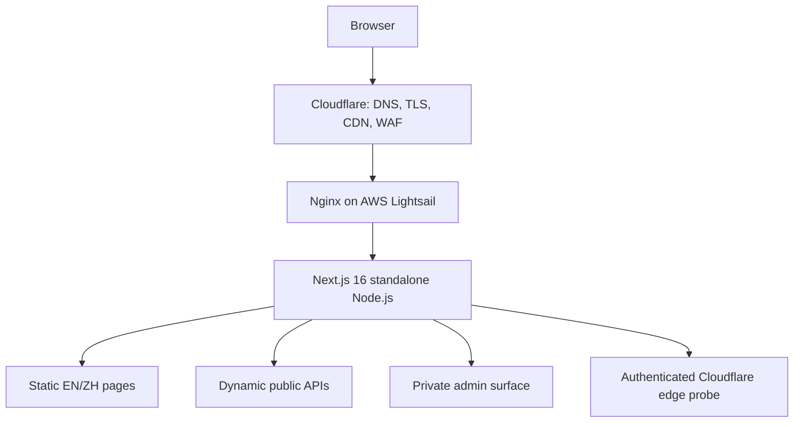
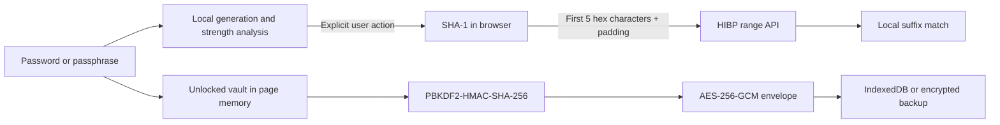

# OpsKitPro Architecture and Trust Boundaries

This document describes the current public Product architecture. It intentionally
omits credentials, private analytics, origin details, and operational procedures.

## System Overview

- Cloudflare is the public edge and private-admin Access layer.
- Nginx is the Lightsail origin proxy.
- Next.js runs as a standalone Node.js service.
- Cloudflare Workers and Workers KV are not the Product runtime.
- Public pages are localized under `/en` and `/zh` and statically generated
  where possible. APIs and admin routes are dynamic.

## Product Layers

### Quick utility layer

Browser-first tools complete a bounded task with minimal input. Examples include
password generation, QR codes, encoding, time conversion, and JSON operations.
These tools should process data locally unless their purpose inherently requires
a network observation.

### Professional diagnostic layer

Website Check, Network Doctor, DNS Security, IP Lookup, and Cloudflare Trace
combine browser observations with bounded server or edge probes. Every finding
must identify its observation point; a server probe must not be presented as the
user's local network result.

### Task-specific assistance layer

Deterministic analysis and future model-backed assistance belong inside a clear
tool workflow. OpsKitPro does not use a general chat interface as its product
center. Model-backed features require an explicit data-flow, cost, quota, and
privacy review before release.

## Password Security Data Flows

### Generation and strength

- Random passwords and passphrases use Web Crypto in the browser.
- Strength evidence is computed locally.
- Password content and strength findings are not sent to OpsKitPro analytics,
  APIs, URLs, or logs.

### Pwned Passwords lookup

- No lookup runs while the user types or when the page loads.
- After an explicit click, the browser computes SHA-1 for HIBP protocol
  compatibility and sends only the first five uppercase hexadecimal characters.
- The request uses `Add-Padding: true`; suffix matching is local.
- The password, full hash, prefix, and result are not persisted by OpsKitPro.
- "Not found" means only that the current dataset contained no match.

### Local encrypted vault

- Format: `opskitpro.vault.v1`.
- KDF: PBKDF2-HMAC-SHA-256, currently 310,000 iterations and a random 16-byte
  salt.
- Cipher: non-extractable AES-256-GCM key, a new random 12-byte IV for every
  write, and authenticated version metadata.
- IndexedDB stores one encrypted envelope; exports use the same encrypted
  format. Plaintext indexes are not stored.
- The master password is not persisted. The derived key exists only while the
  page is unlocked and its reference is cleared on lock.
- Locking occurs explicitly, after five minutes of inactivity, or when the page
  becomes hidden.
- Imports are size/version/parameter bounded and must decrypt successfully
  before replacing local data.
- Permanent reset requires typed confirmation.

The vault does not protect against malicious extensions, XSS, compromised
dependencies, operating-system malware, keyloggers, screen capture, or physical
access to an unlocked device. It is not independently audited and cannot recover
a forgotten master password.

## Diagnostic Boundaries

- Target parsing rejects unsupported protocols, credentials, ports, private and
  reserved destinations, and unsafe redirect targets.
- Live diagnostics bypass application caching and expose bounded evidence rather
  than claiming a universal view.
- Browser, Cloudflare Edge, and Lightsail probe results remain separate
  observations.
- Public APIs use route-appropriate quotas and stable error contracts.

## Localization and Discovery

- Maintained locales: English (`en`) and Simplified Chinese (`zh`).
- Retired `ja` and `tw` routes redirect to maintained equivalents.
- The tool catalog is the source for localized discovery, structured data,
  `/api/tools`, and `/llms.txt`.
- Tool pages expose visible purpose, inputs, outputs, processing location,
  privacy, limitations, examples, and related tools.
- The former Blog module is retired; known valuable URLs redirect to tools and
  unknown routes return 404.

## Repository and Data Ownership

| Area | Owner | Public? |
|---|---|---|
| Product UI, public APIs, tests | `opskitpro` | Yes |
| Operations, analytics, automation, AI memory | `opskitpro-ops` | No |
| Finished static knowledge material | `opskitpro-public` | Yes |

The Product repository must not contain production credentials, private traffic
data, publishing queues, internal reports, or copied `.ai` memory.

## Release Gates

- `npm run verify:fast` runs import checks, lint, application/test type checks,
  production build, and unit/component tests.
- `npm run test:e2e` covers browser workflows when the change warrants it.
- `npm run package:standalone` verifies the Lightsail artifact.
- Security-sensitive features receive focused contract tests, browser checks,
  production smoke tests, and an independently reversible release.
