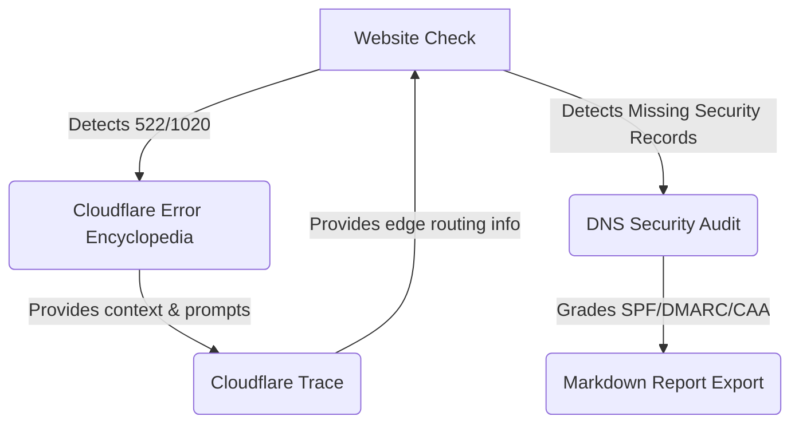

# OpsKitPro Architecture

OpsKitPro is built on a modern edge computing stack emphasizing speed, SEO, and deeply linked diagnostic workflows. 

## Technology Stack
- **Framework**: Next.js 14 (App Router)
- **Deployment Runtime**: Cloudflare Workers via `@opennextjs/cloudflare`
- **Styling**: Tailwind CSS v3
- **Testing**: Playwright (E2E) + Vitest (Unit)

---

## The Diagnostics Hub Architecture

OpsKitPro operates as a **Diagnostics Hub**. Rather than standalone tools, the application flows in a closed-loop funnel designed to identify an issue, explain it, deeply analyze it, and export a report.

### Diagnostic Flow

### 1. Core Tools Layer
- **Website Check** (`src/app/tools/website-check`): The entry point for general users. It queries HTTP status, headers, and basic DNS. Its results dictate which contextual banners are shown.
- **DNS Lookup & Security Audit** (`src/app/tools/dns-lookup`): A specialized tool that queries multiple DNS resolvers and grades domain security against SPF, DMARC, and CAA standards.
- **Cloudflare Trace** (`src/app/tools/cloudflare-trace`): Calls Cloudflare's `/cdn-cgi/trace` endpoint to inspect edge routing attributes like Colo, SNI, and Ray IDs.

### 2. Content & Knowledge Layer
- **Cloudflare Error Encyclopedia** (`src/app/errors`): Static, highly-structured informational pages explaining Cloudflare edge errors (e.g. 522, 1020) and their root causes. This layer serves as the SEO backbone.
- **Case Library** *(Upcoming)*: Real-world, step-by-step troubleshooting templates that combine all tools into a single narrative.

### 3. SEO & Distribution Layer
- **JSON-LD Schema**: Components automatically inject `WebApplication`, `FAQPage`, and `BreadcrumbList` schemas.
- **Internal Link Graph**: Contextual banners and the `RelatedTools` component ensure crawler bots and users flow continuously between tools.
- **Dynamic Sitemap**: Built via `src/app/sitemap.ts` to index all tool pages and dynamically generated error routes.

---

## Testing Strategy

OpsKitPro utilizes a zero-compromise E2E testing methodology heavily focused on the diagnostic closed-loop.

- **Smoke Tests**: Verify core functional requirements of the home page, navigation, and independent tool computations.
- **Diagnostics Hub Closed-Loop** (`e2e/diagnostics-hub.spec.ts`):
  - Validates correct rendering of contextual banners without UI short-circuiting.
  - Assertions on `<head>` metadata for structured JSON-LD.
  - Verifies dynamic sitemap generation.
  - Internal CTA routing logic.

